# Refugio Kimba

### Desarrollo web en Entorno Servidor
### UT02-b Spring Boot | Proyecto – API REST Segura
### __Sara Sánchez Camilleri.__

<hr>
<br>
<br>

# a. Nombre del proyecto.
### Refugio Kimba

* Aplicación web y móvil para la gestión de una protectora de animales.

# b. Idea del Proyecto.

## API REST para una protectora de animales

Con vistas al Trabajo de Fin de Curso (TFC), este proyecto será una práctica que puede evolucionar para convertirse en una herramienta funcional o incluso en una parte del proyecto final.

La idea es desarrollar una aplicación web para una protectora de animales, cuyo objetivo principal será facilitar la gestión de las instalaciones y los animales en busca de adopción, además de promover la participación de voluntarios.

# c. Justificación del proyecto.

La gestión de protectoras de animales es una labor que requiere organización, dedicación y recursos limitados. Sin embargo, en la mayoría de los casos, estos centros dependen de procesos manuales, hojas de cálculo o herramientas básicas para registrar información sobre los animales, adopciones, voluntarios y donaciones.

Esta situación genera varios problemas:

- Falta de eficiencia: La información desorganizada puede retrasar las adopciones y el seguimiento de los animales.
- Dificultades de comunicación: La falta de centralización dificulta la coordinación entre los voluntarios y el personal.
- Pérdida de oportunidades: Sin un sistema adecuado, es más difícil captar padrinos, donantes y adoptantes.

Con este proyecto, buscamos ofrecer una solución práctica y eficiente mediante una aplicación web y móvil que permita:

1. Centralizar toda la información del refugio en un sistema digital seguro.
2. Optimizar los procesos internos, como la gestión de adopciones y apadrinamientos.
3. Mejorar la experiencia de los adoptantes, voluntarios y padrinos al proporcionarles acceso a información actualizada y personalizada.
4. Fortalecer la misión del refugio al facilitar la promoción de los animales en busca de hogar y la captación de apoyo.

<hr>
<br>
<br>

# d. Descripción detallada de las entidades

## 1. Planteamiento de las entidades

### Entidades básicas

Para garantizar un mínimo viable funcional, el proyecto trabajará inicialmente con las siguientes entidades fundamentales:

- Usuarios: Representarán a las personas que interactúan con el sistema. Los usuarios estarán clasificados en distintos roles según sus responsabilidades y actividades: administrador, voluntario, padrino, usuario regular, entre otros.
  - Roles básicos: administrador y usuario genérico.
  - Conforme se amplíen las funcionalidades, se irán incrementando los roles necesarios.


- Animales: Contendrá la información detallada de todos los animales registrados por la protectora, incluyendo datos básicos, estado de salud y disponibilidad para adopción o apadrinamiento.


- Adopciones: Gestionará y registrará la información relacionada con las adopciones realizadas, permitiendo un seguimiento detallado de los animales que han salido del refugio hacia un hogar permanente.

### Ampliación en entidades:

Conforme avance el desarrollo del proyecto, se integrarán nuevas entidades para ampliar las funcionalidades y proporcionar herramientas adicionales tanto para los usuarios como para el personal del centro. Estas futuras incorporaciones están diseñadas para mejorar la experiencia de usuario y optimizar los procesos internos del refugio. Las entidades adicionales son las siguientes:

- Apadrinamiento: Registro de animales apadrinados, asociándolos con usuarios responsables y facilitando la comunicación personalizada con los padrinos.

- Cita Veterinaria: Registro detallado de citas veterinarias asignadas a cada animal mientras permanezcan bajo la tutela del refugio.

- Donaciones: Registro de las donaciones realizadas al refugio, ya sea por usuarios registrados o donantes anónimos.

- Visitas al Centro: Gestión de actividades organizadas por el refugio, como jornadas de adopción y eventos educativos.


## 2. Descripción detallada de las entidades

### Usuarios
Campos principales:

- ```id_usuario```: INT (PK, AUTO_INCREMENT).
- ```nombre```: VARCHAR(100) (NOT NULL).
- ```email```: VARCHAR(255) (NOT NULL, UNIQUE).
- ```telefono```: VARCHAR(9) NOT NULL CHECK (telefono ~ '^[0-9]{9}$').
- ```contraseña```: VARCHAR(255) (NOT NULL, almacenada como hash).
- ```rol```: ENUM (administrador, voluntario, padrino, adoptante, genérico) NOT NULL.

Roles disponibles:

- ```Administrador```: Puede crear, leer, modificar y eliminar registros en la base de datos.
- ```Genérico```: Puede leer registros genéricos, como información sobre animales.

### Animales
Campos principales:

- ```id_animal```: INT (PK, AUTO_INCREMENT).
- ```nombre```: VARCHAR(100) (NOT NULL).
- ```tipo_animal```: ENUM (perro, gato) (NOT NULL).
- ```estado```: ENUM (en adopción, apadrinado, en tratamiento, adoptado) (NOT NULL).

### Adopciones
Campos principales:

- ```id_adopcion```: INT (PK, AUTO_INCREMENT).
- ```id_usuario```: INT (FK, referencia a Usuarios.id_usuario).
- ```id_animal```: INT (FK, referencia a Animales.id_animal).
- ```fecha_adopcion```: DATE (NOT NULL).
- ```observaciones```: TEXT (NULLABLE).

Relaciones:

- **Usuario y Adopciones**: Relación 1:N (Un usuario puede adoptar múltiples animales).
- **Animal y Adopciones**: Relación 1:1 (Un animal solo puede ser adoptado una vez).

<hr>
<br>
<br>

- # Diagrama Entidad/Relación

```plantuml
@startuml
entity "Usuarios" as Usuarios {
    + id_usuario : INT
    + nombre : VARCHAR(100)
    + email : VARCHAR(255)
    + telefono : VARCHAR(9)
    + contraseña : VARCHAR(255)
    + rol : ENUM
}

entity "Animales" as Animales {
    + id_animal : INT
    + nombre : VARCHAR(100)
    + tipo_animal : ENUM
    + estado : ENUM
}

entity "Adopciones" as Adopciones {
    + id_adopcion : INT
    + id_usuario : INT
    + id_animal : INT
    + fecha_adopcion : DATE
    + observaciones : TEXT
}

Usuarios ||--o{ Adopciones : "1:N"
Animales ||--|| Adopciones : "1:1"
@enduml


<hr>
<br>
<br>

# 3. Descripción de los *endpoints*. 

En esta sección se detallan los diferentes endpoints disponibles en la API REST del proyecto Refugio Kimba. Cada uno de ellos está diseñado para manejar las operaciones relacionadas con las principales entidades del sistema, como usuarios, animales y adopciones.

Para cada endpoint se especifican:

- La operación que realiza (por ejemplo, creación, lectura, actualización o eliminación).
- Los roles que tienen acceso a dicho endpoint.
- Las restricciones aplicables, como requisitos de autenticación o permisos específicos.
- El formato de los datos de entrada y salida.
- Las posibles excepciones y los códigos de estado HTTP asociados.

## a. Usuarios.

Los ususarios tendran un método C.R.U.D aunque no todos los tipos de usuarios tendrán acceso a todos los métodos, dependerán del *rol* que tengan.

- ### C.R.U.D

-`POST /usuarios/` : Permiten crearse nuevos usuarios.
- **RUTA PÚBLICA** ✅
  - **Entrada**: JSON con `nombre`, `email`, `telefono`, `contraseña` y `rol`
  - **Restricciones**: Método accesible sólo a los usuarios *administradores*.
  - **Salida**: 201: CREATED -> Usuario creado con éxito. Devuelve el JSON con los datos del usuario creado, incluyendo el `id` que se crea de forma automática.
  - **Excepciones**: 400: BAD_REQUEST -> Cuando los datos son inválidos o faltantes.



- `GET /usuarios/{id}`: Permite a los *administradores* obtener la información de un usuario concreto a través de su ID.
  - **RUTA PÚBLICA** ❌
  - **Entrada**: `ruta` + `id` del usuario.
  - **Restricciones**: Sólo los usuarios `administradores` tienen permiso para obtener ésta información.
  - **Salida**: 200: OK -> Devuelve el JSON con los datos del usuario.
  - **Excepciones**: 400: BAD_REQUEST -> Dátos inválidos.


- `GET /usuarios?rol=ROL` : Obtiene los datos de todos los usuarios que compartan el mismo tipo de rol.
    - **RUTA PÚBLICA** ❌
    - **Entrada**: `ruta` + `rol=ROL` (ej : `GET /usuarios?rol=generico`)
    - **Restricciones**: Sólo los usuarios `administradores` tienen permiso para obtener ésta información.
    - **Salida**: 200: OK -> JSON con los datos de todos los usuarios encontrados.
    - **Excepciones**: 
      - 400: BAD_REQUEST -> Si el valor del *rol* es inválido. 
      - 404 NOT_FOUND -> El *rol* es válido, pero no se encuentra ningún usuario que cumpla el requisito.


- `PUT /usuarios/{id}`: Actualiza la información de un usuario.
    - **RUTA PÚBLICA** ❌
    - **Entrada**: JSON con los campos a actualizar.
    - **Restricciones**: Sólo usuarios *administradores* o el propio usuario pueden modificar éstos datos.
    - **Salida**: 200 OK: JSON con los datos del usuario actualizado.
    - **Excepciones**: 400 Bad Request: Datos inválidos.

- `DELETE /usuarios/{id}`:
    - **RUTA PÚBLICA** ❌
    - **Entrada**: `ruta` + `id` del usuario a eliminar.
    - **Restricciones**: Sólo usuarios *administradores* pueden eliminar usuarios de la base de datos.
    - **Salida**: 200 OK: Mensaje de confirmación de eliminación.
    - **Excepciones**: 404 Not Found: Usuario no encontrado.

- ### **Autenticación**
- `POST  /usuarios/login`
    - **RUTA PÚBLICA** ✅
    - **Entrada**: JSON con `email` y `contraseña`.
    - **Restricciones**: Credenciales válidas son requeridas para autenticación.
    - **Salida**: 200 OK: JSON con el token JWT y datos básicos del usuario.
    - **Excepciones**: 401 Unauthorized: Credenciales incorrectas.

- ### **Registro**


- `POST /usuarios/register/`
    - **RUTA PÚBLICA** ✅
    - **Entrada**: JSON con nombre, email, telefono, contraseña y rol.
    - **Restricciones**: Los usuarios con el rol genérico solo pueden crear usuarios del mismo rol. Los usuarios administradores pueden crear usuarios con cualquier rol.
    - **Salida**: 201 Created: Devuelve JSON con los datos del usuario creado.
    - **Excepciones**: 400 Bad Request: Datos inválidos o faltantes.

<hr>

## b. Animales.

- `POST /animales/`: Permite registrar un nuevo animal en el refugio.
    - **RUTA PÚBLICA** ❌
    - **Entrada**: JSON con nombre, tipo_animal (perro, gato), estado, etc.
    - **Restricciones**: Solo administradores pueden registrar animales.
    - **Salida**: 201 Created: JSON con los datos del animal registrado.
    - **Excepciones**: 400 Bad Request: Datos inválidos o faltantes.

- `GET /animales/{id}`: Permite obtener la información de un animal específico.
    - **RUTA PÚBLICA** ❌
    - **Entrada**: 	`Ruta` con el `ID` del animal.
    - **Restricciones**: Sólo administradores.
    - **Salida**: 200 OK: JSON con los datos del animal solicitado.
    - **Excepciones**: 404 Not Found: Animal no encontrado.

- `PUT /animales/{id}`: Permite actualizar la información de un animal registrado.
    - **RUTA PÚBLICA** ❌
    - **Entrada**: JSON con los datos a actualizar.
    - **Restricciones**: Solo administradores pueden modificar animales.
    - **Salida**: 200 OK: JSON con los datos actualizados del animal.
    - **Excepciones**: 400 Bad Request: Datos inválidos.

- `GET /animales?estado={estado}`: Obtiene una lista de animales según su estado (en adopción, apadrinado, etc.).
    - **RUTA PÚBLICA** ❌
    - **Entrada**: `ruta` + estado por el que se quiere fiiltrar. Ej: `GET animales?estado=apadrionado`
    - **Restricciones**: Sólo administradores.
    - **Salida**: 200 OK: JSON con la lista de animales filtrados por estado.
    - **Excepciones**: 404 Not Found: No se encuentan animales con el estado indicado.
                       400 Bad Request: Datos inválidos.

<hr>

## c. Adopciones.

- `POST /adopciones/`: Permite registrar una nueva adopción en el sistema.
    - **RUTA PÚBLICA** ❌
    - **Entrada**: JSON con id_usuario, id_animal, fecha_adopcion, y observaciones.
    - **Restricciones**: Solo administradores pueden registrar adopciones.
    - **Salida**: 201 Created: JSON con los datos de la adopción registrada.
    - **Excepciones**: 400 Bad Request: Datos inválidos.


- `GET /adopciones/`: Permite obtener una lista de todas las adopciones registradas.
    - **RUTA PÚBLICA** ❌
    - **Entrada**: Ninguna
    - **Restricciones**: Solo administradores pueden acceder.
    - **Salida**: 200 OK: JSON con la lista de adopciones.
    - **Excepciones**: 404 Not Found: Registros no encontrados.

### Excepciones genéricas
 
Los errores más comunes en el manejo de datos con la base de datos incluyen problemas de validación, autenticación, permisos insuficientes, fallos internos del servidor, etc.
Los más comunes que nos encontraremos son:

- `400 BAD_REQUEST`: Datos inválidos o faltantes.
- `401 UNAUTHORIZED`: Falta de autenticación o token inválido.
- `403 FORBIDDEN`: Permisos insuficientes para realizar esta acción.
- `404 NOT_FOUND`: Recurso no encontrado.
- `405 METHOD_NOT_ALLOWED`: Método HTTP no permitido.
- `409 CONFLICT`: Conflicto con el estado actual del recurso.
- `422 UNPROCESSABLE_ENTITY`: Datos correctos pero no procesables.
- `429 TOO_MANY_REQUESTS`: Límite de solicitudes excedido.
- `500 INTERNAL_SERVER_ERROR`: Error inesperado en el servidor.

En caso de que se produzca una excepción, la API devolverá una respuesta en formato JSON que incluirá detalles sobre el error. Este es un ejemplo para un error `404 NOT_FOUND`:

```json
{
  "timestamp": "2024-12-10T12:00:00Z",
  "status": 404,
  "error": "Not Found",
  "message": "El recurso solicitado no existe.",
  "path": "/usuarios/99"
}
```



<hr>
<br>
<br>

# 3. Descripción de los *endpoints*. 

En esta sección se detallan los diferentes endpoints disponibles en la API REST del proyecto Refugio Kimba. Cada uno de ellos está diseñado para manejar las operaciones relacionadas con las principales entidades del sistema, como usuarios, animales y adopciones.

Para cada endpoint se especifican:

- La operación que realiza (por ejemplo, creación, lectura, actualización o eliminación).
- Los roles que tienen acceso a dicho endpoint.
- Las restricciones aplicables, como requisitos de autenticación o permisos específicos.
- El formato de los datos de entrada y salida.
- Las posibles excepciones y los códigos de estado HTTP asociados.

## a. Usuarios.

Los ususarios tendran un método C.R.U.D aunque no todos los tipos de usuarios tendrán acceso a todos los métodos, dependerán del *rol* que tengan.

- ### C.R.U.D

-`POST /usuarios/` : Permiten crearse nuevos usuarios.
- **RUTA PÚBLICA** ✅
  - **Entrada**: JSON con `nombre`, `email`, `telefono`, `contraseña` y `rol`
  - **Restricciones**: Método accesible sólo a los usuarios *administradores*.
  - **Salida**: 201: CREATED -> Usuario creado con éxito. Devuelve el JSON con los datos del usuario creado, incluyendo el `id` que se crea de forma automática.
  - **Excepciones**: 400: BAD_REQUEST -> Cuando los datos son inválidos o faltantes.


- `GET /usuarios/{id}`: Permite a los *administradores* obtener la información de un usuario concreto a través de su ID.
  - **RUTA PÚBLICA** ❌
  - **Entrada**: `ruta` + `id` del usuario.
  - **Restricciones**: Sólo los usuarios `administradores` tienen permiso para obtener ésta información.
  - **Salida**: 200: OK -> Devuelve el JSON con los datos del usuario.
  - **Excepciones**: 400: BAD_REQUEST -> Dátos inválidos.
  - 

- `GET /usuarios?rol=ROL` : Obtiene los datos de todos los usuarios que compartan el mismo tipo de rol.
    - **RUTA PÚBLICA** ❌
    - **Entrada**: `ruta` + `rol=ROL` (ej : `GET /usuarios?rol=generico`)
    - **Restricciones**: Sólo los usuarios `administradores` tienen permiso para obtener ésta información.
    - **Salida**: 200: OK -> JSON con los datos de todos los usuarios encontrados.
    - **Excepciones**: 
      - 400: BAD_REQUEST -> Si el valor del *rol* es inválido. 
      - 404 NOT_FOUND -> El *rol* es válido, pero no se encuentra ningún usuario que cumpla el requisito.


- `PUT /usuarios/{id}`: Actualiza la información de un usuario.
    - **RUTA PÚBLICA** ❌
    - **Entrada**: JSON con los campos a actualizar.
    - **Restricciones**: Sólo usuarios *administradores* o el propio usuario pueden modificar éstos datos.
    - **Salida**: 200 OK: JSON con los datos del usuario actualizado.
    - **Excepciones**: 400 Bad Request: Datos inválidos.


- `DELETE /usuarios/{id}`:
    - **RUTA PÚBLICA** ❌
    - **Entrada**: `ruta` + `id` del usuario a eliminar.
    - **Restricciones**: Sólo usuarios *administradores* pueden eliminar usuarios de la base de datos.
    - **Salida**: 200 OK: Mensaje de confirmación de eliminación.
    - **Excepciones**: 404 Not Found: Usuario no encontrado.


- ### **Autenticación**
- `POST  /usuarios/login`
    - **RUTA PÚBLICA** ✅
    - **Entrada**: JSON con `email` y `contraseña`.
    - **Restricciones**: Credenciales válidas son requeridas para autenticación.
    - **Salida**: 200 OK: JSON con el token JWT y datos básicos del usuario.
    - **Excepciones**: 401 Unauthorized: Credenciales incorrectas.

- ### **Registro**


- `POST /usuarios/register/`
    - **RUTA PÚBLICA** ✅
    - **Entrada**: JSON con nombre, email, telefono, contraseña y rol.
    - **Restricciones**: Los usuarios con el rol genérico solo pueden crear usuarios del mismo rol. Los usuarios administradores pueden crear usuarios con cualquier rol.
    - **Salida**: 201 Created: Devuelve JSON con los datos del usuario creado.
    - **Excepciones**: 400 Bad Request: Datos inválidos o faltantes.

<hr>

## b. Animales.

- `POST /animales/`: Permite registrar un nuevo animal en el refugio.
    - **RUTA PÚBLICA** ❌
    - **Entrada**: JSON con nombre, tipo_animal (perro, gato), estado, etc.
    - **Restricciones**: Solo administradores pueden registrar animales.
    - **Salida**: 201 Created: JSON con los datos del animal registrado.
    - **Excepciones**: 400 Bad Request: Datos inválidos o faltantes.


- `GET /animales/{id}`: Permite obtener la información de un animal específico.
    - **RUTA PÚBLICA** ❌
    - **Entrada**: 	`Ruta` con el `ID` del animal.
    - **Restricciones**: Sólo administradores.
    - **Salida**: 200 OK: JSON con los datos del animal solicitado.
    - **Excepciones**: 404 Not Found: Animal no encontrado.


- `PUT /animales/{id}`: Permite actualizar la información de un animal registrado.
    - **RUTA PÚBLICA** ❌
    - **Entrada**: JSON con los datos a actualizar.
    - **Restricciones**: Solo administradores pueden modificar animales.
    - **Salida**: 200 OK: JSON con los datos actualizados del animal.
    - **Excepciones**: 400 Bad Request: Datos inválidos.


- `GET /animales?estado={estado}`: Obtiene una lista de animales según su estado (en adopción, apadrinado, etc.).
    - **RUTA PÚBLICA** ❌
    - **Entrada**: `ruta` + estado por el que se quiere fiiltrar. Ej: `GET animales?estado=apadrionado`
    - **Restricciones**: Sólo administradores.
    - **Salida**: 200 OK: JSON con la lista de animales filtrados por estado.
    - **Excepciones**: 404 Not Found: No se encuentan animales con el estado indicado.
                       400 Bad Request: Datos inválidos.

<hr>

## c. Adopciones.

- `POST /adopciones/`: Permite registrar una nueva adopción en el sistema.
    - **RUTA PÚBLICA** ❌
    - **Entrada**: JSON con id_usuario, id_animal, fecha_adopcion, y observaciones.
    - **Restricciones**: Solo administradores pueden registrar adopciones.
    - **Salida**: 201 Created: JSON con los datos de la adopción registrada.
    - **Excepciones**: 400 Bad Request: Datos inválidos.


- `GET /adopciones/`: Permite obtener una lista de todas las adopciones registradas.
    - **RUTA PÚBLICA** ❌
    - **Entrada**: Ninguna
    - **Restricciones**: Solo administradores pueden acceder.
    - **Salida**: 200 OK: JSON con la lista de adopciones.
    - **Excepciones**: 404 Not Found: Registros no encontrados.

<hr>
<br>
<br>

### Excepciones genéricas

Los errores más comunes en el manejo de datos con la base de datos incluyen problemas de validación, autenticación, permisos insuficientes, fallos internos del servidor, etc.
Los más comunes que nos encontraremos son:

- `400 BAD_REQUEST`: Datos inválidos o faltantes.
- `401 UNAUTHORIZED`: Falta de autenticación o token inválido.
- `403 FORBIDDEN`: Permisos insuficientes para realizar esta acción.
- `404 NOT_FOUND`: Recurso no encontrado.
- `405 METHOD_NOT_ALLOWED`: Método HTTP no permitido.
- `409 CONFLICT`: Conflicto con el estado actual del recurso.
- `422 UNPROCESSABLE_ENTITY`: Datos correctos pero no procesables.
- `429 TOO_MANY_REQUESTS`: Límite de solicitudes excedido.
- `500 INTERNAL_SERVER_ERROR`: Error inesperado en el servidor.

En caso de que se produzca una excepción, la API devolverá una respuesta con el siguiente formato JSON:
```json
{
  "mensaje": "El recurso solicitado no existe.",
  "uri": "/usuarios/99"
}
```

<hr>
<br>
<br>

## 4. Lógica de negocio.

### Usuarios
1. Crear usuario (`POST /usuarios/`):

   - Permite a los administradores crear nuevos usuarios.
   - Validaciones:
     - El email y teléfono deben ser únicos.
     - Los datos enviados deben cumplir con el formato requerido.
     - Restricciones: Los usuarios genéricos no tienen acceso a este endpoint.


2. Consultar usuario por ID (`GET /usuarios/{id}`):

- Permite a los administradores obtener información detallada de un usuario específico.
- Validaciones:
  - Se verifica que el ID proporcionado exista en la base de datos.
  - Restricciones: Solo accesible por administradores.

3. Consultar usuarios por rol (`GET /usuarios?rol={rol}`):

- Permite filtrar usuarios según su rol.
- Validaciones:
  - El valor del rol debe ser válido (genérico, administrador, etc.).
  - Restricciones: Solo accesible por administradores.

4. Modificar usuario (`PUT /usuarios/{id}`):

- Permite actualizar la información de un usuario.
- Validaciones:
  - Solo el propio usuario o un administrador puede modificar los datos.
  - No se permite que un usuario modifique su propio rol.
  - Restricciones: Rol limitado según permisos.

5. Eliminar usuario (`DELETE /usuarios/{id}`):

- Permite a los administradores eliminar usuarios.
- Validaciones:
  - El ID debe existir en la base de datos.
  - Se valida que el usuario no tenga dependencias activas (como adopciones no finalizadas).

6. Iniciar sesión (`POST /usuarios/login`):

- Autentica a un usuario mediante email y contraseña.
- Proceso:
  - Si las credenciales son válidas, genera un token JWT.
  - El token contiene información básica del usuario y permisos.
- Validaciones:
  - Se verifica que el email y la contraseña coincidan.
  - Se verifica que el usuario no esté inactivo o eliminado.

7. Registro (`POST /usuarios/register`):

- Permite a los usuarios registrarse en el sistema.
- Validaciones:
  - Los usuarios genéricos solo pueden registrar usuarios de su mismo rol.
  - Los administradores pueden registrar usuarios con cualquier rol.
  - Los datos enviados deben cumplir con las reglas definidas (como email único y formato de teléfono).


### Animales

1. Registrar animal (`POST /animales/`):

- Permite a los administradores registrar nuevos animales en el refugio.
- Validaciones:
  - Los datos enviados (nombre, tipo, estado) deben cumplir con los valores permitidos.
  - Un animal no puede registrarse con un estado inválido.

2. Consultar animal por ID (`GET /animales/{id}`):

- Permite obtener información detallada de un animal específico.
- Validaciones:
  - Se verifica que el ID proporcionado exista.
  - Restricciones: Solo administradores tienen acceso.

3. Modificar animal (`PUT /animales/{id}`):

- Permite actualizar los datos de un animal.
- Validaciones:
  - Solo los administradores pueden realizar cambios.
  - Un animal adoptado no puede regresar al estado "en adopción".

4. Consultar animales por estado (`GET /animales?estado={estado}`):

- Permite filtrar animales según su estado (en adopción, apadrinado, etc.).
- Validaciones:
  - Se verifica que el estado sea válido.
  - Restricciones: Solo accesible por administradores.

### Adopciones

1. Registrar adopción (`POST /adopciones/`):

- Permite a los administradores registrar una adopción.
- Validaciones:
  - Se verifica que el animal esté en estado "en adopción".
  - Un usuario no puede adoptar al mismo animal más de una vez.

2. Consultar todas las adopciones (`GET /adopciones/`):

- Permite obtener una lista completa de adopciones registradas.
- Restricciones: Solo accesible por administradores.

### Validaciones generales

- Todos los datos enviados en las solicitudes deben cumplir con las validaciones definidas en los DTOs (como tamaño máximo, campos obligatorios, etc.).
- Se verifica la existencia de recursos referenciados (como IDs de usuarios o animales) para evitar inconsistencias en la base de datos.
- Los permisos de acceso están definidos en función del rol del usuario y se validan en cada solicitud.

<hr>
<br>
<br>

## 5. Restricciones de Seguridad.

Con estas medidas, se busca ofrecer un entorno seguro para todos los usuarios del sistema, protegiendo tanto la integridad de los datos como la privacidad de los usuarios
El proyecto utiliza diversas medidas de seguridad para proteger los datos y garantizar un acceso controlado:

### 1. Autenticación mediante JWT (JSON Web Tokens)
- Los usuarios deben autenticarse con su email y contraseña para obtener un token JWT.
- Mecanismo:
  - El token JWT se genera al iniciar sesión correctamente y contiene información básica del usuario, como su ID y rol.
  - Cada solicitud a rutas protegidas requiere incluir el token JWT en el encabezado de autorización (Authorization: Bearer <token>).
  - Los tokens tienen una fecha de expiración para limitar su validez temporal (ejemplo: 24 horas).
  - En caso de cierre de sesión, el token se invalida en el servidor.

### 2. Autorización basada en roles
- Los permisos de acceso a cada endpoint están definidos según el rol del usuario:
  - Administrador: Tiene acceso total a todos los recursos y operaciones.
  - Genérico: Tiene acceso limitado a ciertos recursos y no puede realizar modificaciones en la base de datos, excepto en sus propios datos.
- Cada endpoint verifica el rol del usuario antes de procesar la solicitud, asegurando que solo las personas autorizadas puedan realizar ciertas acciones.

### 3. Cifrado y seguridad de contraseñas
- Las contraseñas de los usuarios se almacenan utilizando técnicas de hashing seguro (por ejemplo, BCrypt).
- Cada contraseña almacenada incluye un "salt" único para prevenir ataques de fuerza bruta o uso de tablas rainbow.
- Durante la autenticación, la contraseña ingresada se compara con el hash almacenado en la base de datos.

### 4. Validación de entradas
- Se validan los datos enviados por los clientes en cada solicitud:
  - Datos obligatorios: Campos requeridos para procesar la solicitud (por ejemplo, email y contraseña en el login).
  - Formato válido: Uso de expresiones regulares y validaciones específicas para garantizar que los datos (como números de teléfono o correos electrónicos) sean correctos.
  - Prevención de inyección: Todos los datos enviados se parametrizan para evitar ataques de inyección SQL.

### 5. Restricción de métodos HTTP
- Los endpoints solo aceptan los métodos HTTP necesarios:
- Ejemplo: POST /usuarios/register solo permite solicitudes POST; cualquier otro método generará un error 405 METHOD_NOT_ALLOWED.

### 6. Uso obligatorio de HTTPS
- Toda la comunicación entre cliente y servidor debe realizarse a través de HTTPS, garantizando que los datos transmitidos estén cifrados y protegidos contra interceptación.

### 7. Gestión de errores y excepciones
- Los mensajes de error no exponen información sensible al cliente:
  - Ejemplo: En lugar de "Usuario no encontrado en la base de datos", se devuelve un mensaje genérico como "El recurso solicitado no existe."
- Se registra la información completa de cada error en los logs del servidor para facilitar su análisis sin exponer detalles al cliente.

### 8. Prevención de abuso de API
- Se implementan límites de solicitudes para prevenir ataques de fuerza bruta o abuso:
  - Ejemplo: Un usuario no autenticado puede intentar iniciar sesión un número limitado de veces por minuto.
- El servidor responde con un código 429 TOO_MANY_REQUESTS si se exceden los límites configurados.

### 9. Control de acceso a recursos
- Los usuarios solo pueden acceder a los datos que les corresponden:
  - Ejemplo: Un usuario genérico no puede acceder a los datos de otros usuarios ni consultar animales adoptados por otras personas.
  - Los administradores pueden acceder a todos los datos, pero con responsabilidad controlada.